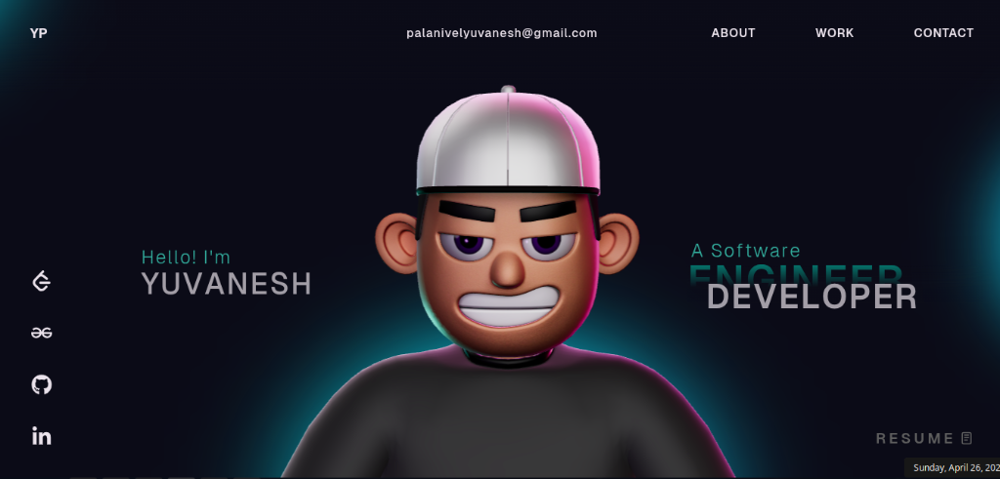

# Yuvanesh's Interactive 3D Portfolio 🚀

Welcome to the open-source repository of my personal portfolio website! 

This is a highly interactive, performance-driven web experience built to showcase my backend engineering skills paired with modern, immersive frontend web development.


*(Note: Please ensure you save your latest screenshot here as `public/images/preview.png` so it renders correctly on GitHub!)*

## ✨ Key Features
- **Immersive 3D Experience**: Integrated a custom 3D avatar using **Three.js** and **React Three Fiber**.
- **Interactive Fluid Animations**: Smooth, scroll-triggered animations powered by **GSAP** (GreenSock Animation Platform) and its ScrollTrigger plugin.
- **Modern UI/UX**: Sleek dark mode design, custom glassmorphism components, and dynamic typography.
- **Project Showcases & Mockups**: Beautifully designed UI layouts showcasing my top projects:
  - **InfoThiran AI**: AI-Powered Research Assistant.
  - **Recursion Visualizer**: Tool to Visualize Recursive Execution.
  - **AI Email Assistant**: Featuring automated Gmail & Google Calendar integration.
- **Fully Responsive**: Optimizations made across mobile, tablet, and ultra-wide displays.

## 🛠️ Tech Stack
- Frontend Framework: **React** (with **TypeScript**)
- Styling: Custom **CSS3** Variables and flex/grid architectures.
- 3D Rendering: **Three.js**, **@react-three/fiber**, **@react-three/drei**
- Animations: **GSAP**
- Build Tool: **Vite**

## 🏃 Quick Start / Local Setup

1. **Clone the repository:**
   ```bash
   git clone https://github.com/yuvnex/Portfolio.git
   ```
2. **Install dependencies:**
   ```bash
   npm install
   ```
3. **Run the development server:**
   ```bash
   npm run dev
   ```

*Heads up on GSAP Plugins*: This setup utilizes GSAP's advanced plugins for animations. If you fork this, ensure you are referencing the trial versions or have your own valid GSAP Club license. Check out: [GSAP Installation Docs](https://gsap.com/docs/v3/Installation/)

## 📬 Contact & Connect
- **LinkedIn:** [Yuvanesh Palanivel](https://www.linkedin.com/in/yuvanesh26/)
- **LeetCode:** [@Yuvanesh26](https://leetcode.com/u/Yuvanesh26/)
- **GeeksforGeeks:** [@yuvaneshpalanivel](https://www.geeksforgeeks.org/profile/yuvaneshpalanivel)
- **GitHub:** [Yuvnex](https://github.com/Yuvnex)

---

### License
This project is open-source and available under the [MIT License](LICENSE).
